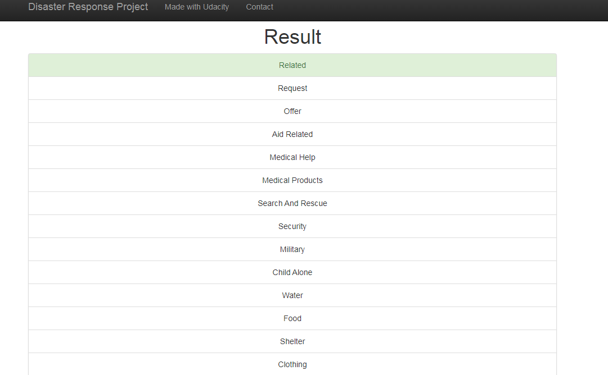
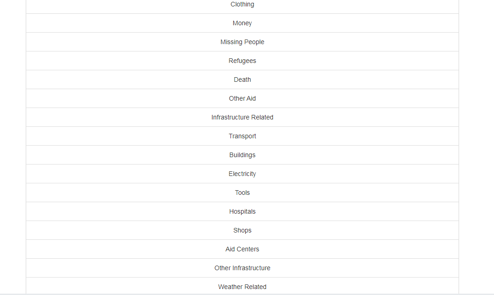
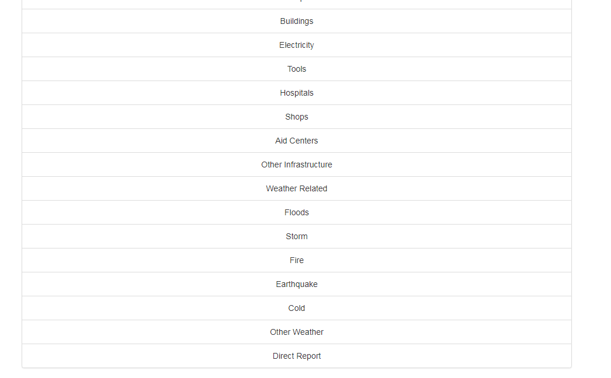

# Disaster Response Pipeline Project

## Table of Contents

- [Instructions](#Instructions)
- [Description](#Description)
- [Installation](#installation)
- [Project Parts](#projectparts)
	- [ETL Pipeline](#ETLpipeline)	
	- [Machine Learning Pipeline](#MLpipeline)
	- [Flask](#flask)
               
- [License](#license)
- [Acknowledgements](#Acknowledgements)

##  Instructions :
----------
   1. Run the following commands in the project's root directory to set up your database and model.

      - To run ETL pipeline that cleans data and stores in database
        `python data/process_data.py data/disaster_messages.csv data/disaster_categories.csv data/DisasterResponse.db`
      - To run ML pipeline that trains classifier and saves
        `python model/train_classifier.py data/DisasterResponse.db model/classifier.pkl`

   2.  Run the following command in the app's directory to run your web app.
    `python app/run.py`

##  Description 
------------
On this course, you have discovered and constructed on your facts data engineering talents to extend your possibilities and potential as a data scientist. On this challenge, you may practice these capabilities to investigate disaster data from Figure Eight to construct a model for an API that classifies disaster messages.

Within the assignment workspace, You'll discover a data set containing real messages that have been sent at some point of disaster activities. You'll be developing a system gaining knowledge of pipeline to categorize those activities so that you can send the messages to the best disaster comfort organization.

Your challenge will encompass a web app in which an emergency worker can input a new message and get type effects in numerous categories. The web app may also display visualizations of the data. This challenge will display off your software capabilities, including your potential to create primary facts pipelines and write clean, prepared code!

Below are a few screenshots of the web app.

## Installation
------------

Installation is as easy as 

This project uses [python3.6](https://www.python.org/doc/) . Go check them out if you don't have them locally installed.

## Project Parts
-------------
There are three things you will need to complete in this project.

   1. ETL pipeline

In the Python text, process_data.py, write the data cleaner:

Upload messages and data categories
It combines two data sets
Cleans data
Stores in SQLite database

   2.  Machine Learning pipeline

 Python script, train_classifier.py, write machine learning pipeline:

    Uploading data from SQLite database
    It divides the database into training and testing sets
    Creates text processing and pipeline learning
    Trains also tuned model using GridSearchCV
    Results results in a test set
    Exporting the last model as a dusty file

  3. Flask Web App

We offer you more with a flask web application, but feel free to add other features depending on your flask, html, css and JavaScript. In this section, you will need to:

Modify data file and model methods as needed
Enter data visibility using Plotly in a web application. One example is given
Github quality and code
Your project will also be categorized based on the following:

Use of Git and Github
Strong texts
Clean and standard code
Follow the RUBRIC when working on your project to make sure you meet all the necessary steps to improve plumbing and web application.
## License
----------------
[MIT](LICENSE) © Tewodros Tessema

Acknowledgements
----------------

Thanks <a href="https://www.udacity.com" target="_blank">Udacity</a> for letting me use their emblem as favicon for this web app.

Every other weblog post became a first rate motivation to enhance my documentation. This publish discusses some of the cool projects from facts <a href="https://in.udacity.com/course/data-scientist-nanodegree--nd025" target="_blank">Data Scientist Nanodegree</a> students. This genuinely suggests how far we are able to cross if we apply the principles learned beyond the school room content to construct some thing that encourage others.
